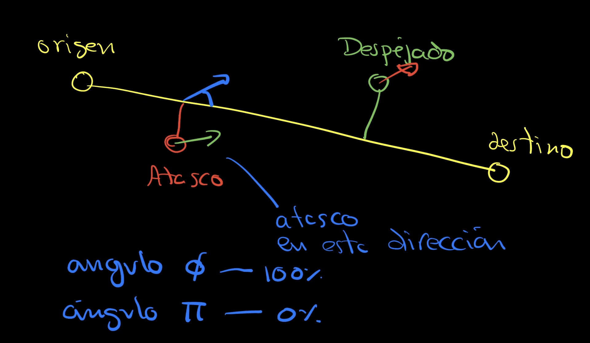

pathfinding multi-agente en tiempo real y con condiciones dinámicas.
I-MAPF

# Estado del Arte en A* para la búsqueda de caminos óptimos en entornos de múltiples agentes en grafos.

El estado del arte en A* para la búsqueda de caminos óptimos en entornos de múltiples agentes en grafos ha evolucionado significativamente en la última década, con numerosos avances en la eficiencia y capacidad de los algoritmos para manejar situaciones complejas y dinámicas. A continuación, se destacan algunos de los desarrollos más notables:

1. **Conflict-based search (CBS)**: CBS es un algoritmo de dos niveles que realiza una búsqueda en un árbol basado en conflictos entre agentes a un nivel alto, y a un nivel bajo, busca caminos para un solo agente a la vez, lo que en muchos casos permite examinar menos estados que A* manteniendo la optimalidad [(Sharon et al., 2012)]

2. **Mejora en entornos dinámicos**: Se ha propuesto un algoritmo de pathfinding multi-agente en tiempo real (CSIDA*) para entornos dinámicos, que mejora la eficiencia en el proceso de cálculo y la estrategia en tiempo real (RTS) mediante el uso de una versión centralizada de SIDA* (CSIDA*) [(Sreeramaneni & Koh, 2015)]

El tiempo real también es una característica clave para describir las necesidades de este Paper.

1. **Selección de algoritmos para optimización**: La investigación sobre la selección de algoritmos ofrece un modelo para determinar cuál de los algoritmos óptimos de MAPF existentes es el más adecuado para usar en una instancia dada, mejorando así la eficiencia en la resolución de problemas [(Kaduri, Boyarski & Stern, 2020)]

Por este se podría empezar, ya que es un meta estudio. 

2. **Push and Rotate**: Este algoritmo completo para pathfinding multi-agente es eficaz en problemas donde hay al menos dos vértices vacíos, utilizando operaciones simples como empujar, intercambiar y rotar para encontrar una solución [(Wilde, Mors & Witteveen, 2014)]

3. **A* Multietiqueta para MAPF**: Se ha desarrollado un algoritmo A* multietiqueta (MLA*) para el problema de pathfinding multi-agente, permitiendo la computación de caminos con múltiples metas ordenadas, mostrando mejoras sustanciales en términos de tiempo de servicio y eficiencia computacional [(Grenouilleau, Hoeve & Hooker, 2019)]

Me gusta el término pathfinding multi-agente.

También podemos estudiar la tesis de Daniel Cajigas.

# Sin repetir artículos mencionando anteriormente, comenta el pathfinding multi-agente en tiempo real el estado del arte.

El desarrollo y la investigación en el pathfinding multi-agente en tiempo real continúan avanzando, ofreciendo soluciones más sofisticadas y eficientes para entornos dinámicos y complejos. A continuación, se resumen algunas contribuciones importantes recientes, excluyendo los artículos mencionados anteriormente:

1. **Multi-Agent Pathfinding with Continuous Time**: Este trabajo introduce un algoritmo de Multi-Agent Pathfinding (MAPF) que no asume duraciones uniformes de acción de los agentes ni discretiza el tiempo en pasos, ofreciendo soluciones completas y óptimas basadas en una combinación novedosa de Safe Interval Path Planning (SIPP) y Conflict-Based Search (CBS) [(Andreychuk, Yakovlev, Atzmon, & Stern, 2019)](https://consensus.app/papers/multiagent-pathfinding-mapf-continuous-time-andreychuk/ec6ab034d9725008a126f175e58adb4c/?utm_source=chatgpt).

2. **Multi-Agent Pathfinding with Real-Time Heuristic Search**: Se presenta un algoritmo de búsqueda heurística en tiempo real para el pathfinding multi-agente, denominado Bounded Multi-Agent A* (BMAA*), que permite a cada agente realizar búsquedas heurísticas en tiempo real, tratando a otros agentes como obstáculos móviles [(Sigurdson, Bulitko, Yeoh, Hernández, & Koenig, 2018)](https://consensus.app/papers/multiagent-pathfinding-realtime-heuristic-search-sigurdson/8103d50b352c5fb48a5156ee5b49c979/?utm_source=chatgpt).

3. **Online Multi-Agent Pathfinding**: Este estudio aborda la versión en línea del problema MAPF, donde nuevos agentes aparecen con el tiempo, presentando algoritmos efectivos para MAPF en línea que equilibran la calidad de la solución, el tiempo de ejecución y el número de cambios de plan que un agente realiza durante la ejecución [(Svancara, Vlk, Stern, Atzmon, & Barták, 2019)](https://consensus.app/papers/online-multiagent-pathfinding-svancara/70f2b22fb2b25020b19f2aa3b61b4834/?utm_source=chatgpt).

4. **Multi-Agent Path Finding with Prioritized Communication Learning**: Este trabajo propone un método de aprendizaje por comunicación priorizada para la planificación de trayectorias multi-agente en entornos de gran escala, como almacenes automatizados, mejorando significativamente las tasas de éxito y reduciendo las colisiones en comparación con planificadores basados en aprendizaje previos [(Li, Chen, Jin, Tan, Zha, & Wang, 2022)](https://consensus.app/papers/multiagent-path-finding-prioritized-communication-li/6a31191a72dd5663a9cfc1e35ca57aef/?utm_source=chatgpt).

5. **Safe Multi-Agent Pathfinding with Time Uncertainty**: Este trabajo considera un problema de MAPF con incertidumbre temporal, donde se dan límites superior e inferior en el tiempo que le toma a cada agente moverse, y propone algoritmos completos y óptimos basados en A* con Descomposición de Operadores (A* + OD) y Conflict-Based Search (CBS) para encontrar soluciones seguras bajo esta incertidumbre [(Shahar, Shekhar, Atzmon, Saffidine, Juba, & Stern, 2021)](https://consensus.app/papers/multiagent-pathfinding-time-uncertainty-shahar/6c76aa1c7bbc59a68ee409d502862ca7/?utm_source=chatgpt).

Estas investigaciones subrayan el progreso continuo en el desarrollo de algoritmos y técnicas para el pathfinding multi-agente en tiempo real, abordando desafíos relacionados con la incertidumbre temporal, la necesidad de planificación en línea y la comunicación entre agentes para evitar colisiones y mejorar la eficiencia en entornos dinámicos.

# Que diferencia hay entre A* y D* ?

A* y D* son dos algoritmos de búsqueda utilizados para la planificación de trayectorias y navegación en entornos. Aunque ambos tienen el objetivo común de encontrar un camino óptimo desde un punto inicial a un punto final en un mapa o grafo, se diferencian principalmente en su aplicación y cómo manejan los cambios en el entorno:

1. **A*** (**A estrella**): Es un algoritmo de búsqueda informada que utiliza heurísticas para guiar su búsqueda hacia el objetivo de manera eficiente. A* es particularmente efectivo en situaciones donde el entorno es estático y conocido de antemano. Calcula el camino más corto entre el punto de inicio y el punto de destino basándose en el costo de moverse entre nodos y una estimación heurística de la distancia restante hasta el objetivo. A* busca minimizar la suma de estos dos valores para cada nodo que visita. Sin embargo, si el entorno cambia después de que A* haya calculado una ruta, puede que sea necesario recalcular toda la ruta desde el principio para adaptarse a los nuevos cambios.

2. **D*** (**Dynamic A-Star**): Fue desarrollado como una mejora de A* para manejar entornos dinámicos, donde los obstáculos, los costos de movimiento entre nodos o el propio objetivo pueden cambiar durante la navegación. D* y sus variantes, como D* Lite, están diseñados para actualizar eficientemente la ruta planificada en respuesta a estos cambios sin necesidad de recomenzar la búsqueda desde cero. Cuando D* detecta un cambio en el entorno, recalcula solo las partes de la ruta que se ven afectadas por este cambio, lo que lo hace más eficiente que A* en entornos que cambian en tiempo real.

En resumen, la diferencia principal entre A* y D* radica en cómo manejan los cambios en el entorno de búsqueda. A* es ideal para entornos estáticos donde el mapa no cambia después de calcular la ruta, mientras que D* y sus variantes son más adecuados para entornos dinámicos, ajustando la ruta planificada a medida que se detectan cambios en el entorno.

# Estado del arte para D* Multi pathfinding multi-agente in real time, uso de GPU

La investigación sobre la aplicación de algoritmos D* para el pathfinding multi-agente en tiempo real utilizando GPU (Unidades de Procesamiento Gráfico) está evolucionando, aunque la información específica sobre D* aplicado directamente en este contexto es limitada. La mayoría de los estudios se centran en la implementación de algoritmos de pathfinding, como A*, y sus variantes adaptadas para ejecutarse en GPUs, aprovechando la capacidad de procesamiento paralelo de las GPUs para manejar múltiples agentes simultáneamente. Aquí hay algunos trabajos relevantes en el área de pathfinding multi-agente en tiempo real usando GPUs:

1. **GPU Accelerated Multi-agent Path Planning Based on Grid Space Decomposition**: Este trabajo describe un método para implementar el pathfinding multi-agente en tiempo real en GPUs, utilizando el algoritmo A* y un mapa de cuadrícula dividido en bloques para planificar rutas potenciales para miles de agentes simultáneamente. La técnica utiliza una descomposición del espacio de búsqueda para desglosar el algoritmo A* en sub-búsquedas paralelas independientes, demostrando ser eficiente para aplicaciones en tiempo real como juegos y robótica [(Caggianese & Erra, 2012)](https://consensus.app/papers/accelerated-multiagent-path-planning-based-grid-space-caggianese/d520632c25425575ad66b3a445830b4a/?utm_source=chatgpt).

2. **Real-Time Adaptive GPU Multiagent Path Planning**: Este capítulo presenta un algoritmo de planificación de rutas para GPUs derivado del algoritmo A* secuencial, permitiendo una ejecución masivamente paralela y en tiempo real. La planificación de rutas en GPUs reduce la memoria requerida para todos los estados y mejora la eficiencia en juegos donde los agentes necesitan encontrar caminos en tiempo real [(Erra & Caggianese, 2012)](https://consensus.app/papers/realtime-adaptive-multiagent-path-planning-erra/f259400c86d4545a8182a1072763a0b0/?utm_source=chatgpt).

3. **Efficient parallel A* search on multi-GPU system**: Aunque este estudio se centra en el algoritmo A*, propone DA*, una versión paralela del algoritmo A* para sistemas multi-GPU, lo cual es relevante para el pathfinding multi-agente en entornos dinámicos. DA* busca aprovechar la arquitectura de múltiples GPUs para acelerar la búsqueda A* con estrategias efectivas de partición de gráficos y comunicación de datos [(He et al., 2021)](https://consensus.app/papers/search-multigpu-system-he/fc27ee5ade9b516587045f90f021582f/?utm_source=chatgpt).

Estos estudios demuestran el interés y la viabilidad de aplicar técnicas de procesamiento paralelo en GPUs para mejorar la eficiencia del pathfinding multi-agente en tiempo real. Aunque la implementación directa del algoritmo D* en GPUs para pathfinding multi-agente no está explícitamente descrita en los trabajos actuales, los enfoques y técnicas descritos para A* y sus variantes ofrecen una base sobre la cual se podrían desarrollar futuras investigaciones y aplicaciones utilizando D* o sus variantes adaptadas para GPUs.

# es apropiado las GPUs para D*?

3. **Adaptación al Modelo de Programación de GPUs**: La programación para GPUs, usando plataformas como CUDA (Compute Unified Device Architecture) de NVIDIA o OpenCL, tiene sus propios desafíos, incluyendo la gestión de la memoria, el diseño de algoritmos paralelos eficientes y el manejo de dependencias entre datos. La adaptación de algoritmos como D*, que tradicionalmente se han ejecutado en CPUs, requiere un diseño cuidadoso para aprovechar al máximo las capacidades de las GPUs.

### Conclusión:

Mientras que las GPUs ofrecen capacidades prometedoras para mejorar el rendimiento del pathfinding multi-agente, especialmente en términos de procesamiento paralelo y eficiencia en aplicaciones en tiempo real, su uso para algoritmos como D* presenta desafíos específicos. La complejidad de estos algoritmos y la necesidad de gestionar dinámicamente los cambios en el entorno hacen que su implementación en GPUs sea no trivial. 

# Estado del arte para D* Multi pathfinding multi-agente in real time

Esta vez sin GPU.

El estado del arte en D* para pathfinding multi-agente en tiempo real abarca diversas estrategias y enfoques para optimizar la planificación de rutas en entornos dinámicos y complejos. Aunque la búsqueda directa sobre estudios específicos de D* en este contexto es limitada, varios trabajos relevantes en el área de pathfinding multi-agente ofrecen insights valiosos y metodologías que podrían ser aplicables o adaptadas a la lógica de D*. A continuación, se destacan algunos enfoques y hallazgos significativos:

Atento al nombre: problema de pathfinding multi-agente (MAPF).

1. **Multi-Agent Pathfinding with Continuous Time**: Propone un algoritmo para el problema de pathfinding multi-agente (MAPF) que no asume duraciones uniformes de acciones ni discretiza el tiempo en pasos. Este enfoque, que combina Safe Interval Path Planning (SIPP) y Conflict-Based Search (CBS), es completo y ofrece soluciones óptimas, destacando su aplicabilidad en entornos dinámicos y complejos [(Andreychuk, Yakovlev, Atzmon, & Stern, 2019)]

2. **Multi-Agent Pathfinding with Real-Time Heuristic Search**: Introduce Bounded Multi-Agent A* (BMAA*), un algoritmo de búsqueda heurística en tiempo real para pathfinding multi-agente. Cada agente realiza una búsqueda heurística en tiempo real, actualizando valores heurísticos y considerando a otros agentes como obstáculos móviles. Este enfoque mejora las tasas de finalización y reduce los tiempos de finalización en comparación con algoritmos previos [(Sigurdson, Bulitko, Yeoh, Hernández, & Koenig, 2018)]

Se parece a mi idea de marcar un Rasster que recogiera con redes neuronales las rutas óptimas.

1. **Incremental Multi-agent Path Finding with LPA**: Presenta un enfoque incremental para el problema de pathfinding multi-agente (I-MAPF), que es crítico en entornos donde el mapa o las misiones de los agentes pueden cambiar. Este trabajo introduce CBS-D*-lite, que combina Conflict-Based Search (CBS) con D*-lite para replanificación eficiente, minimizando la necesidad de recalcular planes completos ante cambios en el entorno [(Semiz & Polat, 2021)]

2. **Multi-Agent Path Finding using Dynamic Distributed Deep Learning Model**: Explora el uso de modelos de aprendizaje profundo para el pathfinding multi-agente, proporcionando una solución dinámica capaz de adaptarse a cambios en el entorno y gestionar de manera efectiva las colisiones y superposiciones de rutas entre agentes. Este enfoque subraya el potencial de técnicas de inteligencia artificial avanzadas en la mejora de la planificación de rutas en tiempo real [(Sinkar, Izhan, Nimkar, & Kurhade, 2021)]

Aunque utiliza aprendizaje profundo como tu campo, son las derivadas, puede ser interesante conocer las bases.

adaptables, eficientes y escalables. 
Aunque no se centran exclusivamente en D*, 

# Describe D*

El algoritmo D* (Dynamic A-Star) es una variante del conocido algoritmo A* diseñado específicamente para entornos dinámicos, donde los obstáculos o las condiciones del terreno pueden cambiar durante el tiempo de ejecución. Desarrollado inicialmente por Anthony Stentz en los años 90, D* es un algoritmo de planificación de caminos que puede actualizar eficientemente una ruta óptima a medida que descubre nuevos obstáculos, sin necesidad de recalcular toda la ruta desde cero.

### Características principales de D*:

1. **Optimización dinámica**: A diferencia de A*, que asume un conocimiento completo y estático del entorno, D* está diseñado para adaptarse a los cambios, haciendo que sea adecuado para robots o agentes que se mueven en entornos cambiantes.

2. **Replanificación eficiente**: Cuando un agente se encuentra con un obstáculo no previsto, D* ajusta el camino ya calculado en lugar de empezar la búsqueda de camino desde el principio. Esto se logra mediante la revisión de los nodos afectados por el cambio y ajustando sus costos de ruta correspondientes.

3. **Basado en heurísticas**: Al igual que A*, D* utiliza funciones heurísticas para estimar el costo desde un nodo dado hasta el objetivo. Esto permite que D* priorice la exploración de rutas que parecen más prometedoras, mejorando la eficiencia de la búsqueda.

### Variantes de D*:

- **D* Original**: La versión original de D* comenzaba desde el objetivo y trabajaba hacia atrás hasta el punto de partida. Aunque era eficaz en entornos dinámicos, era computacionalmente costoso en ciertos escenarios.

- **D* Lite**: Propuesto por Sven Koenig y Maxim Likhachev, D* Lite mejora la eficiencia computacional del algoritmo original, invirtiendo la dirección de la búsqueda (comenzando en el punto de inicio y avanzando hacia el objetivo) y aplicando optimizaciones que reducen el número de operaciones necesarias cuando se replanifica.

- **Field D***: Una variante que extiende D* para trabajar en espacios continuos en lugar de en una cuadrícula discreta, permitiendo su aplicación en una gama más amplia de entornos.

Me resulta curioso que de trabaje con cuadrículas. 

### Aplicaciones de D*:

- **Robótica móvil**: Para la navegación autónoma de robots en entornos donde los obstáculos pueden aparecer o cambiar dinámicamente.

- **Videojuegos**: Para el movimiento de personajes no jugadores (NPCs) en mundos de juego que cambian en tiempo real.

- **Sistemas de vehículos autónomos**: Donde es crucial adaptarse rápidamente a cambios inesperados en las rutas debido a obstáculos temporales, tráfico, o cambios en las condiciones del camino.

Este listado es apropiado para justificar el estado del arte. 


# Conflict-Based Search (CBS)

Conflict-Based Search (CBS) es un algoritmo de búsqueda desarrollado para resolver el problema de planificación de caminos multi-agente sin colisiones. Fue introducido por Guni Sharon, Roni Stern, Ariel Felner y Nathan R. Sturtevant. CBS es un algoritmo de dos niveles que se basa en la idea de encontrar caminos que sean óptimos a nivel global para un grupo de agentes, evitando cualquier tipo de conflicto, como colisiones, entre ellos.

### Características clave de CBS:

1. **Búsqueda de dos niveles**: CBS opera utilizando dos niveles de búsqueda. En el nivel alto, el algoritmo identifica conflictos entre los caminos de los agentes. Un conflicto ocurre cuando dos agentes planean estar en la misma posición al mismo tiempo. Para cada conflicto detectado, el algoritmo crea dos nuevos nodos en el árbol de búsqueda, cada uno representando una restricción adicional para uno de los agentes involucrados, con el objetivo de evitar el conflicto. En el nivel bajo, CBS realiza búsquedas individuales para cada agente, teniendo en cuenta las restricciones establecidas por el nivel alto, para encontrar caminos que cumplan con estas restricciones.

2. **Optimalidad**: Bajo ciertas condiciones, CBS puede garantizar encontrar una solución óptima, es decir, el conjunto de caminos que minimiza algún criterio global, como el tiempo total o la distancia recorrida por todos los agentes.

3. **Completo y óptimo**: Siempre que exista una solución, CBS la encontrará, y esta será óptima en términos de la longitud total de los caminos (suponiendo que el nivel bajo encuentra caminos óptimos individuales).

4. **Flexibilidad**: CBS puede adaptarse para optimizar diferentes objetivos simplemente ajustando el criterio de optimización utilizado en el nivel bajo de búsqueda.

### Aplicaciones de CBS:

- **Robótica**: En escenarios donde múltiples robots necesitan navegar por un espacio compartido sin colisiones.

- **Logística y almacenes automatizados**: Donde se requiere coordinar el movimiento de múltiples vehículos autónomos o carretillas elevadoras.

- **Videojuegos**: Para el movimiento coordinado de personajes no jugadores en entornos complejos.

### Ventajas y desventajas:

- **Ventajas**:
  - CBS es completo y, bajo ciertas condiciones, óptimo.
  - Es relativamente sencillo de implementar y entender.
  - La estructura de dos niveles permite una gran modularidad.

- **Desventajas**:
  - La eficiencia del algoritmo puede disminuir significativamente a medida que aumenta el número de agentes, debido al crecimiento exponencial del espacio de búsqueda.
  - La solución óptima a nivel global puede resultar en ineficiencias a nivel individual de los agentes.

# Paper para estudiar CBS

Uno de los trabajos fundamentales para estudiar el algoritmo de Conflict-Based Search (CBS) para el pathfinding multi-agente es:

- **Título**: "Conflict-based search for optimal multi-agent pathfinding"
- **Autores**: Guni Sharon, Roni Stern, Ariel Felner, Nathan R Sturtevant
- **Año**: 2012
- **Resumen**: En el problema de pathfinding multi-agente (MAPF), se deben encontrar caminos para varios agentes, cada uno con una posición inicial y final diferente, de tal manera que los agentes no colisionen. Solucionadores óptimos anteriores aplicaron búsquedas globales basadas en A*. Este trabajo presenta un nuevo algoritmo de búsqueda llamado Conflict-Based Search (CBS). 

A lo mejor CBS no es óptimo para desplazamiento de vehículo, ya que estos no tienen colisiones, sino que se enculan y demoran. 

CBS es un algoritmo de dos niveles. En el nivel alto, se realiza una búsqueda en un árbol basado en conflictos entre agentes. En el nivel bajo, se realiza una búsqueda solo para un agente a la vez. En muchos casos, esta reformulación permite que CBS examine menos estados que A* mientras mantiene la optimalidad. El documento analiza CBS y muestra sus beneficios y desventajas. Los resultados experimentales en varios problemas muestran una aceleración de hasta un orden de magnitud sobre enfoques anteriores.
- **Publicación**: [Acceder al artículo]
- **DOI**: 10.1016/j.artint.2014.11.006

Este artículo es esencial para comprender la estructura y el funcionamiento de CBS, incluyendo sus niveles de búsqueda alto y bajo, la manera en que gestiona los conflictos entre agentes, y cómo esto permite encontrar soluciones óptimas para el pathfinding multi-agente sin colisiones. Además, discute las ventajas y limitaciones del algoritmo, proporcionando una base sólida para futuras investigaciones o implementaciones prácticas del algoritmo CBS en sistemas multi-agente.

# mapf para simulación de trafico.

La simulación de tráfico utilizando el enfoque de pathfinding multi-agente (MAPF) ha sido explorada en varios estudios, destacando la complejidad y los desafíos únicos de este ámbito. A continuación, se destacan algunos trabajos relevantes:

1. **"Multi-Agent Pathfinding with Continuous Time"** por A. Andreychuk, K. Yakovlev, Dor Atzmon, y Roni Stern (2019). Este trabajo propone un algoritmo MAPF que no asume duraciones uniformes de acciones ni discretiza el tiempo en pasos. Está basado en una combinación novedosa de Safe Interval Path Planning (SIPP) y Conflict-Based Search (CBS), proporcionando soluciones completas y óptimas. Este enfoque es relevante para la simulación de tráfico al permitir la planificación en tiempos continuos, un requisito frecuente en la modelización del tráfico realista [(Andreychuk et al., 2019)]

Este artículo es actual. 

1. **"Simulation system for traffic control based on multi-agent"** por Lou Lian-tang (2010). Este modelo propone un sistema de control de tráfico basado en multi-agentes. Integra tecnología de agentes en sistemas inteligentes para control de tráfico, aplicando distribución de Poisson, detección de colisiones AABB, y sistemas de partículas para construir el objeto agente. Este sistema simula eficazmente el tráfico utilizando C++ y OpenGL, mostrando cómo los agentes autónomos pueden gestionar el flujo de tráfico en tiempo real [(Lou, 2010)]

Aquí tienes una implementación, interesante compatible con nuestro trabajo. 


# que es detección de colisiones AABB es

Creo que me imagino lo que es, es el algoritmo de colisión que has programado muchas veces. 

La detección de colisiones AABB se refiere al método de detección de colisiones utilizando "Axis-Aligned Bounding Boxes" (AABB). Es un enfoque común en la computación gráfica, los videojuegos y las simulaciones físicas para determinar de manera eficiente si dos objetos están colisionando o no. Este método es particularmente útil para objetos que se mueven y cambian de posición a lo largo del tiempo.

### Características Principales:

1. **Axis-Aligned**: Los "bounding boxes" o cajas delimitadoras están alineados con los ejes del sistema de coordenadas, lo que significa que no rotan con el objeto que contienen. Esto simplifica mucho los cálculos de detección de colisiones, ya que solo se necesita comparar los límites de las cajas en cada eje para determinar una colisión.

2. **Bounding Box**: Un AABB es un paralelepípedo (en 3D) o un rectángulo (en 2D) que encierra completamente un objeto en la escena. Cada caja se describe típicamente por dos puntos: el mínimo y el máximo, que representan las esquinas opuestas de la caja.

3. **Eficiencia**: Comparar AABBs para detectar colisiones es muy eficiente computacionalmente. Solo requiere unas pocas comparaciones y operaciones aritméticas para determinar si dos cajas se superponen en todos los ejes correspondientes.

### Cómo Funciona:

Para determinar si dos AABBs colisionan, se verifica si existe alguna separación entre las cajas en cualquiera de los ejes. Si no se encuentra tal separación en todos los ejes, entonces las cajas están colisionando. Matemáticamente, esto se puede expresar como sigue para el caso 2D:

Reconozco que esta idea incluso mejor que la que yo tenía, porque lo que detecta en la separación y yo me concentraba en la intersección que requiere más comparaciones. 

- Dos AABBs, A y B, colisionan si y solo si:
  - `A.max.x >= B.min.x` y `A.min.x <= B.max.x`, y
  - `A.max.y >= B.min.y` y `A.min.y <= B.max.y`.

Para el caso 3D, se añade una tercera condición que compara las coordenadas `z`.


A pesar de su eficiencia y simplicidad, un inconveniente de usar AABBs es que pueden ser una aproximación bastante grosera para objetos que no son aproximadamente rectangulares o para objetos que rotan significativamente, lo que podría llevar a falsos positivos en la detección de colisiones. 

# Interval Path Planning (SIPP) 

Esta idea le puede interesar a Fernando Díaz, ya que asegura el choque de los obstáculos. 

Safe Interval Path Planning (SIPP) es un algoritmo avanzado para la planificación de caminos en entornos donde existen obstáculos dinámicos o incertidumbres. Diseñado inicialmente para la robótica móvil, SIPP ha encontrado aplicaciones en una variedad de áreas, incluyendo la simulación de tráfico y la planificación de rutas para múltiples agentes en entornos dinámicos. Su principal innovación es la capacidad de manejar de manera eficiente los cambios en el entorno que pueden ocurrir en el tiempo, permitiendo que el planificador genere rutas seguras y eficientes incluso cuando los obstáculos aparecen o se mueven.

### Principios Clave de SIPP:

1. **Intervalos Seguros**: SIPP opera basándose en el concepto de "intervalos seguros". Un intervalo seguro es un período de tiempo durante el cual un agente puede ocupar un punto específico en el espacio sin colisionar con obstáculos móviles. Estos intervalos se calculan en función de las trayectorias conocidas de los obstáculos y cualquier otra incertidumbre en el entorno.

2. **Grafos de Espacio-Tiempo**: El algoritmo construye un grafo de espacio-tiempo en el que los nodos representan posiciones en el espacio y los momentos en el tiempo en que están disponibles (es decir, cuando se encuentran dentro de un intervalo seguro). Los bordes del grafo representan las transiciones posibles de un nodo a otro, considerando tanto el movimiento espacial como el avance en el tiempo.

3. **Búsqueda Eficiente**: SIPP utiliza técnicas de búsqueda eficientes, como A*, para encontrar el camino óptimo a través del grafo de espacio-tiempo, tomando en cuenta los intervalos seguros. Esto permite encontrar rutas que evitan obstáculos dinámicos mientras minimizan el tiempo de viaje o cualquier otro costo asociado.

Estos conceptos son buenos para referenciarlos en la introducción del problema o bibliografía. 

### Ventajas de SIPP:

- **Flexibilidad**: Puede manejar una amplia gama de escenarios, desde entornos estáticos hasta dinámicos, con múltiples obstáculos móviles.
- **Eficiencia**: A pesar de la complejidad adicional de manejar obstáculos dinámicos, SIPP es computacionalmente eficiente, lo que lo hace práctico para aplicaciones en tiempo real.

Esta característica es también la que le gusta a Fernando. 

- **Seguridad**: Garantiza la seguridad de las rutas generadas al considerar explícitamente los intervalos de tiempo en los que los caminos están libres de obstáculos.

En resumen, SIPP ofrece un marco robusto y flexible para la planificación de caminos en entornos con incertidumbres y obstáculos dinámicos, facilitando la creación de sistemas de navegación seguros y eficientes en una amplia variedad de aplicaciones.

# Artículo: [Multi-Agent Pathfinding with Continuous Time](https://arxiv.org/pdf/1901.05506.pdf)

## Abstract 
Multi-Agent Pathfinding (MAPF) is the problem of 
finding paths for multiple agents such that every 
agent reaches its goal and the agents do not col­lide. Most prior work on MAPF was on grids, 

Otra vez me vuelvo a encontrar la referencia de que los algoritmos antiguos estaban diseñados en Grill. Cuestión que viene muy bien para nuestro proyecto.

as­sumed agents’ actions have uniform duration, and 
that time is discretized into timesteps. We propose 
a MAPF algorithm that does not rely on these as­sumptions, is complete, and provides provably op­timal solutions. This algorithm is based on a novel 
adaptation of Safe interval path planning (SIPP),

Nuevamente es una adaptación de SIPP.
Que a su vez es una versión modificada de conflict base Search CBS.

 a continuous time single-agent planning algorithm, 
and a modified version of Conflict-based search 
(CBS), a state of the art multi-agent pathfinding al­gorithm. We analyze this algorithm, discuss its pros 
and cons, and evaluate it experimentally on several 
standard benchmarks.

 La introducción se mencionan vehículos autónomos, no había imaginado que el a estrella estaba relacionado con otro de mis intereses.
 
 solving MAPF optimally is NP Hard.
 
 AI researchers in the past years have made 
substantial progress in finding optimal solutions to a growing 
number of scenarios and for over a hundred agents [Sharon 
et al., 2015; Sharon et al., 2013; Wagner and Choset, 2015; 
Standley, 2010; Felner et al., 2018; Bartak´ et al., 2017; 
Yu and LaValle, 2013]. H

El problema de estos autores era la discreción del tiempo y del espacio. 


Adjunto una tabla de forma gráfica del Paper en el que se comparan las características de distintos algoritmos. 

Me estoy desviando de los objetivos. No me interesa el estudio continuo del problema, me interesa más la dinámica de las rutas y por tanto creo que he de profundizar primero en las versiones dinámicas.

# Recomienda un paper reciente de pathfinding multi-agente en tiempo real y con condiciones dinámicas, no importa que el tiempo y el espacio sean discretos.

Un artículo reciente y relevante sobre pathfinding multi-agente en tiempo real y con condiciones dinámicas, incluso en entornos con tiempo y espacio discretos, es:

- **Título**: [LIMP: Incremental Multi-agent Path Planning with LPA](https://www.scitepress.org/Papers/2022/108244/108244.pdf) 
- **Autores**: Mücahit Alkan Yorganci, Fatih Semiz, Faruk Polat
- **Año**: 2022
- **Resumen**: Este trabajo introduce un algoritmo incremental para resolver el problema de pathfinding multi-agente (MAPF), enfocado en entornos de tiempo discreto y espacio discreto con costo unitario para todos los bordes. Se propone un algoritmo llamado LIMP (Incremental Multi-agent Path Planning with LPA*) y DLPA* (Discrete Lifelong Planning A*) para resolver I-MAPF (Incremental MAPF). LIMP combina CBS-D*-lite, un enfoque previo, y DLPA*, una versión adaptada del algoritmo Lifelong Planning A* para un solo agente, mostrando una mejora en la velocidad comparado con otras soluciones y manteniendo un costo similar en términos de planificación.

Este estudio aborda directamente los desafíos de planificación de rutas en entornos dinámicos y cambiantes, proporcionando una solución eficaz para entornos donde el tiempo y el espacio son discretos. La metodología propuesta en "LIMP: Incremental Multi-agent Path Planning with LPA" se centra en mejorar la velocidad de planificación sin sacrificar la calidad del costo de los caminos, lo cual es crítico para aplicaciones en tiempo real donde las condiciones pueden cambiar rápidamente.

Keywords: AI, Multi-agent, Pathfinding, MAPF, Incremental Planning

El problema de pathfinding multi-agente (MAPF) se define como encontrar caminos sin conflictos para más de un agente. Existen solucionadores óptimos y subóptimos para MAPF, y la mayoría de los solucionadores se centran en el problema MAPF en entornos estáticos, pero el mundo real está lejos de ser estático. Motivados por este requisito, en este artículo, introducimos un algoritmo incremental para resolver MAPF. Nos enfocamos en entornos de tiempo discreto y espacio discreto con un costo unitario para todos los bordes. 

Qué es el concepto de un coste unitario para todos los bordes?  
Aquí es donde se referencia. Hemos averiguado que el coste unitario es una simplificación. Tenemos problemas en la simulación de tráfico?
En principio, si tenemos un en mente un Grid no tendríamos porque tener problemas. aunque en las últimas implementaciones, estamos habilitando el movimiento diagonal, que sabemos que tiene raíz de dos. 

Propusimos un algoritmo llamado planificación de caminos multi-agente incremental con LPA* (LIMP) y planificación de vida A* discreta (DLPA*) para resolver I-MAPF (MAPF Incremental).

Qué es MAPF Incremental?

LIMP es la combinación de dos algoritmos que son la Búsqueda Basada en Conflictos D*-lite (CBS-D*-lite) (Semiz y Polat, 2021) y DLPA*. DLPA* es simplemente una versión adaptada de la planificación de vida A* (Koenig et al., 2004) que es un algoritmo de búsqueda incremental para un agente. 

Esta es la típica frase que tienes que aprender a poner en un abstrac. 

Hemos demostrado que LIMP supera en términos de velocidad a la replanificación de Búsqueda Basada en Conflictos (CBS-replanner) y CBS-D*-lite (Semiz y Polat, 2021). Además, en términos de costo, LIMP y CBS-D*-lite tienen un rendimiento similar, y están cerca del CBS-replanner.

## Qué es el concepto de un coste unitario para todos los bordes.  

se refiere a la simplificación en la que cada movimiento de un nodo (o posición) a otro incurre en un costo constante, independientemente de las diferencias específicas que podrían existir en el terreno, distancia real, o cualquier otro factor que normalmente afectaría el costo de moverse de un lugar a otro en aplicaciones del mundo real.

En un grafo, que es una representación matemática comúnmente utilizada para modelar problemas de pathfinding, los nodos representan posiciones o estados, y los bordes conectan estos nodos, representando los posibles movimientos o transiciones entre estados. Al asignar un "coste unitario" a todos los bordes, se está indicando que cada transición tiene el mismo valor de costo, por ejemplo, 1. Esto simplifica el cálculo y la comparación de rutas, ya que la ruta más corta puede ser determinada simplemente contando el número de transiciones (o bordes) que se deben atravesar, sin necesidad de ponderar las diferencias en los costos de los bordes.

### Aplicaciones y Consideraciones:

- **Simplicidad**: Esta aproximación simplifica significativamente los algoritmos de pathfinding, haciendo más fácil calcular el camino más corto o eficiente entre dos puntos.

- **Uniformidad**: Permite tratar a todos los movimientos de manera igualitaria, útil en entornos donde las diferencias en costos de movimiento son irrelevantes o desconocidas.

- **Eficiencia**: En muchos casos, el enfoque de coste unitario puede aumentar la eficiencia computacional al reducir la complejidad de las operaciones necesarias para comparar y seleccionar caminos.

Sin embargo, este enfoque puede no ser adecuado para todas las aplicaciones, especialmente aquellas en las que las diferencias en los costos de movimiento son importantes para la precisión del modelado o la toma de decisiones, como en la planificación de rutas para vehículos en diferentes tipos de carreteras o la navegación de robots en terrenos con variadas dificultades de movimiento. En tales casos, se pueden emplear modelos más complejos que asignen costos diferentes a los bordes basándose en criterios específicos.

Esta simplificación si la tiene el Paper, hace que no sea útil. Porque invalida el poderse utilizar en el problema del tráfico.

# MAPF Incremental

Este término debiéramos utilizarlo en la introducción, es justamente el problema que queremos. 

El término "MAPF Incremental" se refiere a una variante del problema de pathfinding multi-agente (MAPF) que aborda escenarios dinámicos en los que los cambios en el entorno, los objetivos de los agentes, o la aparición de nuevos agentes pueden ocurrir a lo largo del tiempo. En el contexto de MAPF, tradicionalmente se busca encontrar caminos para múltiples agentes desde sus posiciones iniciales hasta sus destinos finales de manera que se eviten las colisiones entre ellos y con obstáculos estáticos, asumiendo un conocimiento completo y estático del entorno.

### Características Principales del MAPF Incremental:

- **Dinamismo**: A diferencia del MAPF clásico, que se considera en un entorno estático donde todos los agentes y sus objetivos son conocidos de antemano, el MAPF Incremental se centra en entornos donde pueden surgir nuevos agentes, objetivos o cambios en el entorno a lo largo del tiempo. Esto requiere que el sistema de pathfinding sea capaz de adaptarse y replanificar según sea necesario.

Este requisito me encanta sobre todo aparición de nuevos coches y nuevos objetivos a lo largo del tiempo. 

- **Replanificación**: Un aspecto clave del MAPF Incremental es la capacidad de realizar replanificaciones eficientes sin tener que resolver todo el problema desde cero cada vez que ocurre un cambio. Esto implica actualizar los caminos de los agentes afectados por los nuevos agentes, objetivos o cambios en el entorno, minimizando las interrupciones y manteniendo la eficiencia general.

El concepto de planificación es también muy interesante. 
En mi proyecto personal estaba también planteando un sistema a estrella con variables de origen y destino que se podría beneficiar de este concepto. 

- **Algoritmos Incrementales**: Para abordar esta variante del problema, se utilizan algoritmos incrementales o adaptativos que pueden manejar cambios en el conjunto de datos de entrada (como la adición de nuevos agentes o cambios en el mapa) de manera más eficiente que recomenzar la solución desde el principio. Estos algoritmos mantienen y actualizan la solución existente en respuesta a los cambios, lo que puede llevar a una considerable reducción en el tiempo de computación necesario para adaptarse a las nuevas condiciones.

Esto es como cerrar una calle al tráfico. 

# CBS-D*-lite (Semiz y Polat, 2021)
Semiz, F. and Polat, F. (2021). 
Incremental multi-agent path finding. 
Future Generation Computer Systems, 116:220–233.

Los algoritmos existentes de pathfinding multi-agente (MAPF) son métodos offline que buscan encontrar caminos sin conflictos para más de un agente. En muchas aplicaciones de la vida real, es posible que un plan multi-agente no se pueda ejecutar completamente debido a algunos cambios en el entorno (representado como un grafo), o en misiones en las que están involucrados los agentes. Incluso en caso de un cambio menor, el algoritmo de planificación offline debe reiniciarse desde cero para generar un nuevo plan, y esto a menudo requiere una cantidad sustancial de tiempo. Motivados por este requisito de la vida real, 

Me encanta la forma en la que justifica el Paper. Fue motivado por la vida.

introdujimos el problema de Pathfinding Multi-Agente Incremental (I-MAPF). Cualquier ubicación (nodo) en el entorno inicial (grafo) puede volverse no disponible por algún tiempo y luego volverse disponible nuevamente. Los agentes pueden ser informados sobre estos cambios antes de que ocurran y algunos agentes tienen que actualizar sus planes si planeaban usar esa ubicación. 

La Búsqueda Basada en Conflictos (CBS) es uno de los algoritmos más exitosos para resolver problemas de MAPF. 

Esto tiene que ir en cualquier referencia.

Hasta donde sabemos, no existen estudios actuales que intenten resolver el problema I-MAPF. 

Qué forma más diplomática de decir que se desconoce algo. 
Imagina este texto en la definición de mi Paper de la cinemática inversa. 
Es muy fuerte la afirmación porque es del 2021.

En este documento, proponemos un nuevo método para resolver el problema I-MAPF, llamado CBS-D*-lite. CBS-D*-lite se basa en CBS y evita la replanificación para los agentes que no están afectados por los cambios ambientales. Para lograr esto, CBS-D*-lite emplea D*-lite, un algoritmo de pathfinding incremental para un solo agente como el método de búsqueda de nivel inferior en CBS. 

Hay que estudiar por tanto CBS. No conozco qué significa nivel inferior.
Me puedes explicar CBS en concreto qué significa un método de búsqueda de nivel inferior.

Mostramos que el número de pasos temporales requeridos para resolver un problema generalmente es menor que con CBS regular. Empíricamente, mostramos que el CBS-D*-lite proporcionó resultados más rápidos que el CBS regular, y el costo total proporcionado por CBS-D*-lite generalmente está cerca de los valores de costo total proporcionados por el CBS regular cuando hay cambios ambientales.


## Me puedes explicar CBS en concreto qué significa un método de búsqueda de nivel inferior.

En el contexto de los algoritmos de planificación de caminos para múltiples agentes, como el Conflict-Based Search (CBS), un "método de búsqueda de nivel inferior" se refiere a la parte del algoritmo encargada de encontrar caminos individuales para cada agente, considerando las restricciones específicas impuestas por el nivel superior del algoritmo.

### CBS y su Estructura de Dos Niveles

CBS es un algoritmo de dos niveles diseñado para resolver el problema de pathfinding multi-agente (MAPF), donde el objetivo es planificar caminos para varios agentes de tal manera que se eviten colisiones entre ellos y se cumplan sus objetivos individuales.

- **Nivel Superior**: En el nivel superior, CBS identifica conflictos entre los caminos de los agentes. Un conflicto ocurre cuando dos agentes están planeados para ocupar la misma ubicación en el mismo momento. Para cada conflicto identificado, el algoritmo genera dos nuevos nodos en su árbol de búsqueda, cada uno representando una restricción adicional para evitar el conflicto. Estas restricciones se pasan al nivel inferior para ajustar la planificación de caminos.

- **Nivel Inferior**: El nivel inferior es donde cada agente planifica su camino individualmente, teniendo en cuenta las restricciones impuestas por el nivel superior. Este es el "método de búsqueda de nivel inferior". La función de este nivel es encontrar el camino más óptimo para un agente dado, ajustándose a las restricciones actuales (por ejemplo, evitar ciertas ubicaciones en momentos específicos para prevenir colisiones). Dependiendo de la implementación de CBS, este nivel puede utilizar diversos algoritmos de pathfinding, como A estrella, para realizar la búsqueda de caminos.

# Estudiar CBS
G. Sharon, R. Stern, A. Felner, N.R. Sturtevant, Conflict-based search for 
optimal multi-agent pathfinding, Artificial Intelligence 219 (C) (2015) 
40–66, http://dx.doi.org/10.1016/j.artint.2014.11.006.


# Continuar con Incrementa multi-agent path finding

# DLPA*, una versión adaptada del algoritmo Lifelong Planning A*
DLPA* es simplemente una versión adaptada de la planificación de vida A* (Koenig et al., 2004) que es un algoritmo de búsqueda incremental para un agente.

# Continuar con LIMP
ya has estudiado las bases, continua con el artículo actualizado.

# web of sciens número de citas.
https://www.webofscience.com/wos/alldb/summary/42c9d795-8456-484b-9053-05612ee5ddb0-dacf1583/times-cited-descending/1


# Mi implementación.

Se trata de una estructura que se ejecuta por agente.
Es un A start modificado.

A diferencia del A* en el que se almacenan caminos.
En esta versión no se descargan los caminos, y apuntan al padre.


Otra diferencia es que cuando se abre un camino, A* no mantiene el camino parcial:


¿Que se pretende? Mantener memoria fija. Lo que acelera los computos.
Hacer uso de la caché y no realizar llamadas al sistema operativo.

A* realiza una estimación heurística por nodo y ordena, seleccionando las opciones mas prometedoras.

En el caso de ** se identifica el nodo mas prometedor recorriendo la memoria.

Cuando la memoria se llena es necesario borrar un candidato.
Para ello se vuelve a recorrer la lista para identificar el candidato a borrar.

Para no borrar un padre con hijos lo que se reliza es que el mejor de los hijos pone su valor a todos los padres.

Se debe realizar una implementación secuencia y una en paralela.
¿Esto se puede implementar con numpy?
¿Podemos en paralelo tener cientos de coches compartiendo este procedimiento?
Listemos las operaciones.

En contra: Son distintos tipos de datos los heurísticos de los enteros.
Solución: Se traba solo con números enteros.

1. Detección del mínimo/máximo. Se recorre la lista completa. Todos paralelos.
2. Actualización de los padres. Hay algunos que no hacen nada, la cabeza se actualiza a si misma.

[] ¿Cómo es almacenado el gráfo? ¿Dóde se guarda la estructura dinámica?
Nos interesa que sea una tabla en el que viene el id destino y heurístico.
Como es una bifulcación habrá al menos 2.
Podemos comprar la idea de Fernando para numpy.


| Id0 | Id1 | H1 | Id2 | H2 |
|-----|-----|----|:----|:---|

Esta estructura si tiene 3 o más salida se contana:

| Id0 | Id1 | H1 | Id_ | 0 |
|-----|-----|----|:----|:---|
| Id_ | Id3 | H1 | Id4 | H2 |

En este caso Id_ es un nodo auxiliar, e Id0 tiene como hijos Id1, Id3 e Id4.

Yo haría un cambio en la estructura el Id0 es la posición?
No podemos porque hay Id_
en dicho caso yo pondría una columna con el número de hijos.

Id0 ocupa la posición 0.
Desplazo al resto.
No puedo crear cambios dinámicos en los caminos del grafo.

| (Id0) | Id1 | H1 | Id3 | H4 |  1|
|-------|-----|----|:----|:---|---|
| (Id0) | Id4 | H4 | Id5 | H5 |  0|

El 1 indica que hay una fila mas.
La segunda 0 queda ociosa, puede usarse para indicar el número de datos.
Número negativo datos llenos, positivo, cojo.
Otra posibilidad es usarlo para indicar donde está la continuidad.

3. Apertura de un hijo.

El problema es que cuando se abren un hijo no está asegurado que termina en un número finito de pasos, algunos operarán mas que otros.
Algunos se quedarán con la tarea de abrir un segundo nodo.

4. Borrado.

Tampoco está asegurado si tiene mas o menos hijos al borrar un padre.
No termina en un número finito de pasos.

Operaciones pendientes, que en algunas columnas requieren mas ciclos:

Borrado. Apertura.

Y el listado completo de operaciones es:

Búsqueda minimo.
Búsqueda máximo.
Actulización padre.
Borrado.
Apertura.

¿Como cambias los caminos si cambian los pesos? 

Si apuntamos una tabla y actualizamos que ruta hay que actualizar si cambia el peso.

## ¿Cómo es la recomputación del peso?

Recordemos que tenemos:

| (Id0) | Id1 | H1 | Id3 | H4 |  1|
|-------|-----|----|:----|:---|---|
| (Id0) | Id4 | H4 | Id5 | H5 |  0|

¿El número de rutas que depende de un dato concreto se guarda en una memoria.

Id [Ruta .... Ruta]

La idea es enlazar a las rutas.

Id Ruta

Ruta nodo Id Ruta2

He de añadir un nodo para informar que la Ruta2 también usa este nodo.

El problema es que buscar en numpi, donde me tengo que registar es variable.

5. Registrando en ruta

No es bueno.

Tenemos una capacidad de búsqueda, podemos definir un número de rutas.
Idea buena en principio, pero no podemos modificar una ruta si hay un cambio.

Alternativa: Replantear el algoritmo en el próximo bifulcación.

Puedo solo recalcular según mi capacidad a los mas ultimo-actualizados.
De tal forma que siguen por inercia si quiero mantener el ritmo.

Solo tienes que hacer recálculo si hay un cambio de nivel.

Me he acordado de que había una optimización heurística.
No calculo la ruta hasta el final.

## Describe D*.

Fue introducido por Anthony Stentz en la década de 1990 como una extensión del algoritmo A* para manejar de manera eficiente la replanificación de rutas en entornos dinámicos. D* está optimizado para situaciones donde el entorno de navegación puede cambiar durante la ejecución del algoritmo, lo que requiere ajustes continuos en el camino previamente calculado.

Al principio pensé que era durante el cálculo, pero es durante el trayecto, que se guarda la ruta del coche, mejor dicho, la memoria de la ejecución para replantearlo.

### Funcionamiento de D*

D* invierte la dirección de búsqueda de A*, comenzando desde el objetivo hasta el punto de partida. Esta característica lo hace especialmente útil en entornos donde el punto de partida es más susceptible a cambios que el destino. Cuando detecta un cambio en el entorno, como un nuevo obstáculo, D* puede ajustar el camino ya calculado en lugar de comenzar la búsqueda desde cero.

Vale, esta la idea de que la subestación deja la ruta en las bifurcaciones.

### Características Principales

- **Incremental**: D* es capaz de actualizar su planificación de forma incremental, ajustando solo las partes del camino afectadas por cambios en el entorno, en lugar de recalcular toda la ruta.

Me pregunto si con numpy en los caminos podríamos hacer actualizaciones de ruta. Con memoria limitada.
Tu haces una ruta directa y anotas en las bifurcaciones cuanto se tarda. 
Si cambia ajustas otros ... no lo veo.


- **Eficiencia**: A través de su capacidad de replanificación incremental, D* minimiza el número de cálculos necesarios para adaptarse a los cambios, lo que resulta en un procesamiento más rápido en comparación con recalcular la ruta completa cada vez.

- **Versatilidad**: Es adecuado para una amplia gama de aplicaciones, desde la navegación de robots en terrenos variados hasta la planificación de rutas en videojuegos.

### Variantes de D*

Existen varias variantes de D* diseñadas para optimizar y extender su aplicabilidad:

- **D* Lite**: Simplifica y mejora el algoritmo original de D*, reduciendo su complejidad computacional. Fue diseñado por Sven Koenig y Maxim Likhachev. D* Lite mantiene la eficiencia en la replanificación de rutas en entornos dinámicos y es actualmente una de las variantes más populares y utilizadas de D*.

- **Focused D***: Introduce optimizaciones para concentrar la búsqueda en áreas que son más probables de afectar el camino óptimo, mejorando la eficiencia en entornos grandes y complejos.

- **Anytime D***: Proporciona soluciones subóptimas rápidas y mejora la calidad de la ruta con el tiempo disponible, lo que lo hace útil en situaciones donde el tiempo de respuesta rápido es crítico.

Esta es interesante también. Me recuerda mi idea de abandonar a medias ya que la ruta no es necesaria tenerla por completo para empezar a moverse. Existe el riesgo de entrar en una calle sin salida.

# Utilizo chatgpt4 sin consensus para sacar el algoritmo.

El algoritmo D* (Dynamic A*) es una variante del conocido algoritmo A* diseñada para planificación de caminos en entornos dinámicos o desconocidos, donde la información sobre el entorno puede cambiar o ser incompleta. Fue desarrollado por Anthony Stentz en la década de 1990. D* es particularmente útil en robótica y aplicaciones de navegación autónoma, donde los obstáculos pueden aparecer o cambiar mientras el robot se está moviendo, y se requiere adaptación en tiempo real para encontrar nuevos caminos.

D* se basa en el concepto de replanificación eficiente. A diferencia de A*, que planifica una ruta desde el inicio hasta la meta y luego sigue esa ruta sin considerar cambios, D* es capaz de ajustar su plan a medida que se descubre nueva información, reduciendo así la necesidad de recomenzar la búsqueda desde cero.

Existen varias versiones de D*, siendo las más conocidas D* Lite y Focused D*. Estas versiones optimizan y mejoran el algoritmo original en términos de eficiencia computacional y capacidad de respuesta ante cambios dinámicos en el entorno.

### Cómo funciona D*:

1. **Inicialización**: Al igual que A*, D* comienza con un nodo inicial (el punto de partida) y un nodo objetivo. Sin embargo, a diferencia de A*, D* trabaja en reversa, desde el objetivo hasta el inicio, lo que facilita la adaptación a los cambios en el entorno.

2. **Replanificación**: D* monitorea el entorno en busca de cambios que afecten el camino planificado, como la aparición de nuevos obstáculos. Si se detecta un cambio, el algoritmo ajusta el camino en consecuencia.

3. **Costos y Evaluación**: D* utiliza una función de coste para evaluar los nodos, similar a la función \(f(n)\) de A*, que combina el costo real hasta el nodo actual \(g(n)\) con una heurística que estima el costo desde ese nodo hasta el objetivo \(h(n)\).

4. **Actualización de la Ruta**: Si se encuentran cambios en el entorno, D* recalcula parcialmente la ruta para acomodar esos cambios, actualizando los costos de los nodos afectados y, si es necesario, encontrando una nueva ruta hacia el objetivo.

# Hay versiones multi agente

Sí, existen versiones del algoritmo D* y sus variantes adaptadas para entornos multiagente. En aplicaciones multiagente, múltiples agentes necesitan planificar sus rutas en un entorno compartido, lo cual puede ser particularmente desafiante debido a la necesidad de coordinar las acciones de los agentes para evitar colisiones y optimizar el uso del espacio y de los recursos. Estas versiones adaptadas están diseñadas para manejar la complejidad adicional que presentan los entornos multiagente.

### D* y Multiagente

La adaptación de D* para entornos multiagente se enfoca en permitir que múltiples agentes naveguen simultáneamente en un espacio compartido, teniendo en cuenta no solo los obstáculos estáticos sino también las trayectorias y las posiciones de los otros agentes. Estas versiones deben manejar aspectos como:

- **Detección y Evitación de Conflictos**: Identificar posibles colisiones o interferencias entre las rutas de los agentes y ajustar las trayectorias para evitarlas.
- **Planificación Coordinada**: Coordinar las rutas de los agentes para optimizar el movimiento general dentro del entorno, lo que puede incluir la asignación de prioridades o la negociación de pasajes estrechos.
- **Comunicación entre Agentes**: Permitir el intercambio de información entre agentes sobre sus rutas planificadas, posiciones actuales, y posibles cambios en el entorno.

### Variantes y Extensiones

Las variantes como D* Lite y Focused D* también pueden ser extendidas para aplicaciones multiagente. Estas extensiones generalmente incorporan mecanismos de comunicación y coordinación para que los agentes puedan compartir información relevante sobre sus planes de ruta y el estado del entorno.

Uno de los enfoques comunes en la planificación de caminos multiagente es el uso de técnicas de descomposición, donde el problema de planificación global se divide en subproblemas más pequeños y manejables. Esto puede incluir la asignación de áreas específicas del entorno a agentes particulares o la planificación de rutas en diferentes fases o capas.

### Desafíos y Consideraciones

La adaptación de algoritmos de planificación de caminos para entornos multiagente introduce una serie de desafíos adicionales, incluyendo:

- La escalabilidad con el número de agentes.
- La eficiencia en la comunicación y en el cálculo de las rutas.
- La capacidad de adaptarse dinámicamente a los cambios en el entorno y a las acciones de otros agentes.

A pesar de estos desafíos, las versiones multiagente de D* y sus variantes representan un área de investigación activa y tienen aplicaciones significativas en campos como la robótica enjambre, la automatización de almacenes, y los sistemas de transporte inteligente.

# La descripción es física, mi deseo es en términos de eficiencia computacional. ¿Que me puedes decir?

Cuando hablamos de eficiencia computacional en el contexto de algoritmos de planificación de caminos para entornos multiagente, como las versiones adaptadas de D* para uso multiagente, nos referimos principalmente a cómo estos algoritmos gestionan los recursos computacionales en términos de tiempo de ejecución, uso de memoria, y capacidad para escalar con el número de agentes y la complejidad del entorno. La eficiencia computacional es crucial en aplicaciones en tiempo real, donde los agentes deben responder rápidamente a cambios dinámicos en el entorno.

### Eficiencia en Tiempo de Ejecución

El tiempo que toma calcular o recalcular rutas es un factor crítico. En entornos dinámicos o multiagente, los algoritmos deben ser capaces de proporcionar rápidamente nuevas rutas en respuesta a cambios en el entorno o a las acciones de otros agentes. Las versiones multiagente de D* buscan minimizar el tiempo de replanificación, utilizando técnicas como la replanificación incremental, donde solo se recalculan las partes de la ruta afectadas por cambios, en lugar de replanificar toda la ruta desde cero.

### Uso de Memoria

El almacenamiento de información sobre el estado del entorno, las rutas planificadas, y los cálculos intermedios puede requerir una cantidad significativa de memoria, especialmente en entornos grandes y complejos. Los algoritmos eficientes buscan optimizar el uso de la memoria, por ejemplo, mediante la representación compacta de datos o la limpieza activa de información obsoleta o innecesaria.

### Escalabilidad

La escalabilidad se refiere a cómo el rendimiento del algoritmo cambia a medida que aumenta el número de agentes o la complejidad del entorno. En contextos multiagente, es deseable que el incremento en el tiempo de cómputo y el uso de memoria sea lo más lineal posible con respecto al número de agentes. Esto es desafiante debido a la necesidad de gestionar interacciones entre agentes y posibles conflictos de ruta.

### Técnicas para Mejorar la Eficiencia Computacional

- **Descomposición del espacio de búsqueda**: Particionar el entorno en regiones más pequeñas puede reducir la complejidad de la planificación de rutas individuales.
- **Planificación jerárquica**: Utilizar una aproximación de arriba hacia abajo, donde se planifican primero rutas a gran escala y luego se refinan detalles a nivel local.
- **Uso de heurísticas**: Las heurísticas bien elegidas pueden guiar la búsqueda de manera más eficiente hacia la meta, reduciendo el número de nodos explorados.
- **Optimizaciones basadas en conflictos**: Detectar y resolver conflictos entre las rutas de los agentes de manera anticipada para evitar replanificaciones costosas.

En resumen, la eficiencia computacional en algoritmos multiagente como las versiones de D* para uso multiagente se centra en optimizar el tiempo de ejecución, el uso de memoria y la escalabilidad. Esto implica equilibrar la necesidad de respuestas rápidas y adaptativas con el uso eficiente de los recursos computacionales, especialmente en aplicaciones en tiempo real y en entornos complejos.

# D* Lite
# D* Lite MA

# Se podría hacer un diagrama con la estructura.
# Hay que traducir la versión del algoritmo.


# Idea
Combinar la construcción de atras a adelante con la de adelante a atras.
Se puede empezar a replantear el camino con marcas de agua temporales hasta encontrar dos nodos cuyas marcas no cambian.

La idea de detectar un bloqueo y esquivar no es la apropiada para describir una carretera cuya densidad de tráfico es mayor o menor.

Hay una de las operaciones que se te ha pasado describir: Cuando hay que actualizar el peso es mejor dejar solo lo que contribuye el actual.
Si se usan marcas de tiempo, se puede detectar las zonas que han cambiado de la ruta. 

# Mi algoritmo

class Buscador:
	def __init__(self,profundidad):
		self.cell=None
		self.father=None
		self.heuristico=0
		self.open=False
		
open -1 y luego si tiene hijos.
0 si es el destino.

Estoy estudiando que ocurre si tiene punteros en las dos direcciones.
¿Cómo es el recálculo D*?


Gráfico con caminos ascendentes y descendentes.

No veo que sea sencillo computar un doble grafo. No es recomendado en esta etapa porque estoy cerrando la versión en python. Aunque reconozco que es el tipo de problemática que le gusta a José Luis.

Tienes una tabla del grafo con heurísticos cambiantes y con tiempos de cuando se hiceron los cambios.
Cuando cambias un tiempo haces una lista enlazada.
La lista enlazada es mala para ejecutar las cosas en forma tabla, numpy o cuda.


# Problema aplicar padre.

```
if heuristico<esta.heuristico:
	# Encuentra una mejor solución procede a su reemplazo
	mejora=heuristico-esta.heuristico
	b.father=father
	#aplica mejora recursiva
	esta.heuristico=heuristico
	self.aplicarPadre
	propagación padre?
	self.aplicarHijos(buscador,esta,mejora)
```
	
No estamos seguros del ... mejor hijo.
Si inserto mejor hijo puedo ...
no se cual es la base, tendría que crear variable.
si tengo la base, se la mejora del puntero y se si mi actual mejora.

Se podría mantener una parte heurística entre las búsquedas activas.
Distáncia entre A y C.
Y si abro algo, nuevas distancias.
Se abre el link mas prometedor, esto daría una versión greedy.
Si es el mayor te aseguras éxito.

## Idea de la matriz de tres dimensiones


Se trata de meter las operaciones heurísticas como nuevos nodos.
Se trabaja desde el origen y la fuente.
Se hacen todas las permutaciones de entre los abiertos.
Esto puede ser limitado en memoria al expresarse en formato tabular matricial.
Apropiado para numpy porque:
1. la memoria está contenida.
2. se pueden obtener max/min por filas/columnas.
3. En la zona azul se puede almacenar la suma del heurístico como el recorrido efectuado por el origen y el destino.

En caso de introducirse una misma letra y esta el mínima está cerrado el circuito.
Hay una estructura de datos de lista enlazada que puede identificar cuando hay un cambio de peso en un link. 
Las calles sin salida, parece mas cerca pero no está, son las trampas.
Si el camino tiene menos de n entre tampas se garantiza que se llega al óptimo?

Al dibujarlo hay un truco de usar las letras por orden de exploración.

El cambio de peso afecta a una fila y columna, podemos actualizar su peso.
Pero tiene hijos abiertos, que también pueden actualizar sus pesos.
Si la conexión no es mínima hay que recomputar.

¿Cómo son estas operaciones?
Se lanza procesos de actualización que afectan a hijos de filas y columnas.
No garantiza la tabularidad, es por CPU. Ni el recorrido de los A* que se deben cambiar, ni el recorrido por los grafos de la tabla.

Si es por tiempo, encuentra una solución rápida y le puede quedar la esperanza de encontrar una mejor solución.
Se pueden cerrar hijos, quedando el heurístico trastocado para que no se vuelva a abrir.
Incluso con las marcas de tiempo, puede hacer que solo se recuestione cada cierto tiempo.

Esta idea es genial ya que los pesos cambian constantemente. 

En una misma tabla no interesa meter dos búsquedas ya que las tabularidades son muy grandes. Pero al estar enlazadas puedo consultar un deteminado nodo a donde llega.
Puedes usar las tablas para precargar zonas intermedias.
Pero ¿Es eficiente calcular zonas intermedias?

# existe un A* Multi agente ejecutado en cuda, cada nucleo ejecuta una búsqueda A* ?

Hasta mi última actualización en abril de 2023, la implementación específica de un algoritmo A* multiagente ejecutado en CUDA (Compute Unified Device Architecture) de NVIDIA, donde cada núcleo ejecuta una búsqueda A* independiente, no es un tema ampliamente discutido en la literatura científica disponible públicamente. CUDA permite la programación de GPUs para realizar cálculos de propósito general, y es ciertamente capaz de paralelizar tareas computacionalmente intensivas como la búsqueda A*.

Las notas de Fernando son curiosas:

cada calle tiene 40 celdas.
Hay 50000 coches en circulación en Sevilla.
1250 búsquedas de A* por cada tick de simulación.

# Cache de distiancias

Gráfico de red neuronal que sirve de caché.
Inicialmente imagino un modelo estilo word 2 vec.
Pero lo descarto por uno con coordenadas x e y y que tengan operadores de diferencias, multiplicaciones, sumas y comparaciones. Elevados a algo (para la raíz cuadrada).

Se introducen puntos claves en la red como mapa autoorganizado que al activasen afecta al cálculo de la distancia. Estos puntos se pueden graficar.

Estos puntos se activan según la proyección del punto mas cercano a la recta.


Gráfico de un trayecto en 2 d, de un origen y destino. Se traza una recta y se haya los puntos mas cercanos, proyectados. Estos según su cercanía a la proyección afectan al trayecto. 

Problema: sería interesante que fuera reflexivo.


Gráfico que añade un ángulo, realizando el producto escalar podemos interpretar un ángulo del sentido del atásco. De tal forma que añadimos un parámetro mas, tiene interpretación física. Pi significa que no afecta.


aunque según comparo, si hay una barrera física se ve afectado.
Quizá el grado debiera ser mas estrecho o definido.


El ángulo de atenuación hace que ya no afecte a una determinada dirección.

# Detalles de la implementación


Se ha añadido tiempo.
El heurístico empleado es:


siendo la distancia lo que queda y el tiempo lo transcurrido.

Cuando se habla del transcurrido es según la estimación de suavizado de la celda.


La idea de la fórmula es que conforme pasa el tiempo la estimación de tiempo tiende a ser lo que da el inverso de la velocidad.


